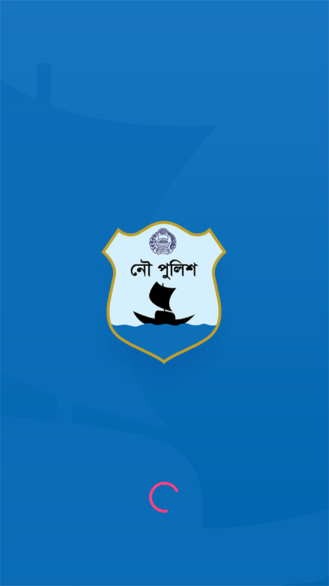
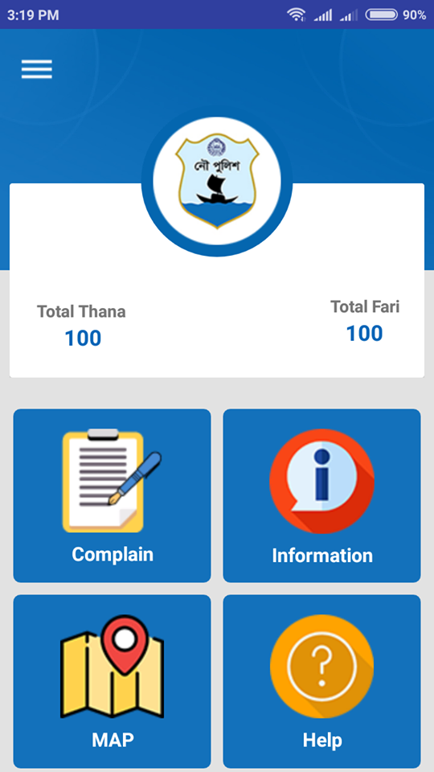
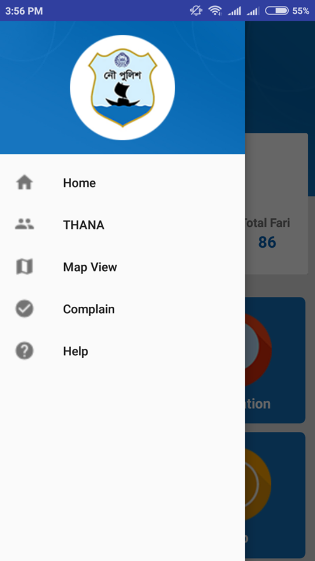
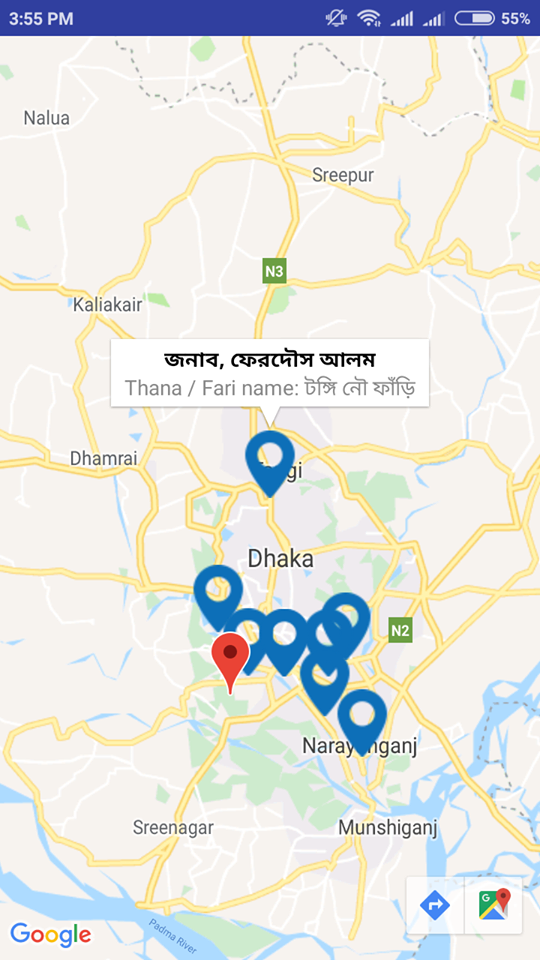
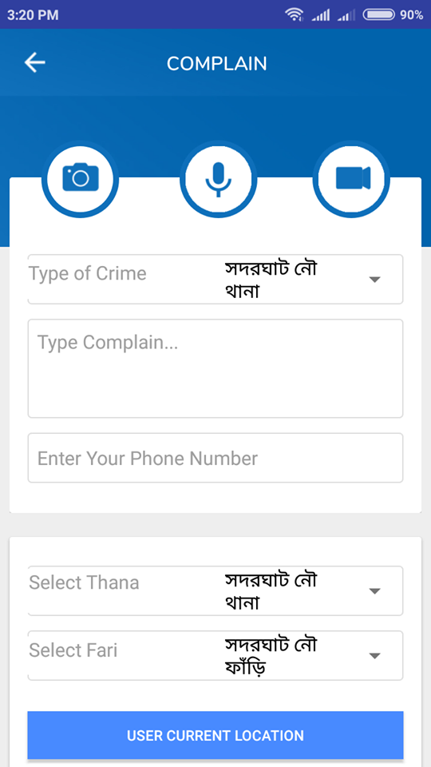

Bangladesh neval police Android apps
### Show some :heart: and star the repo for the project
     

This repository containing links of all the Bangladesh neval police Android apps demonstrating features/functionality/integrations in Android Development application development.

### Some Screenshots

 

  

  

